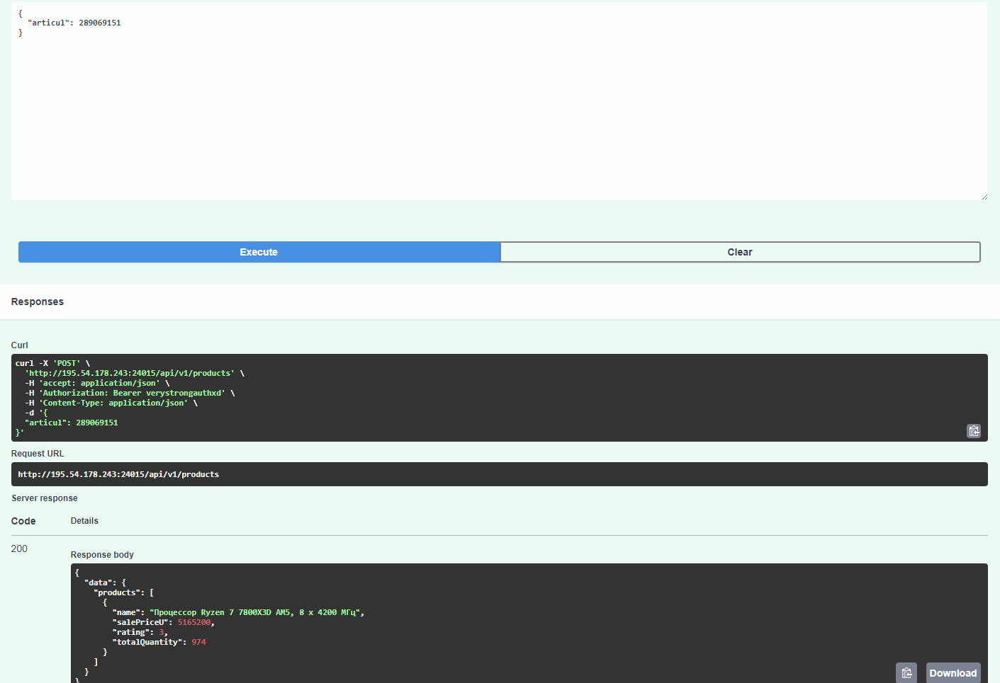
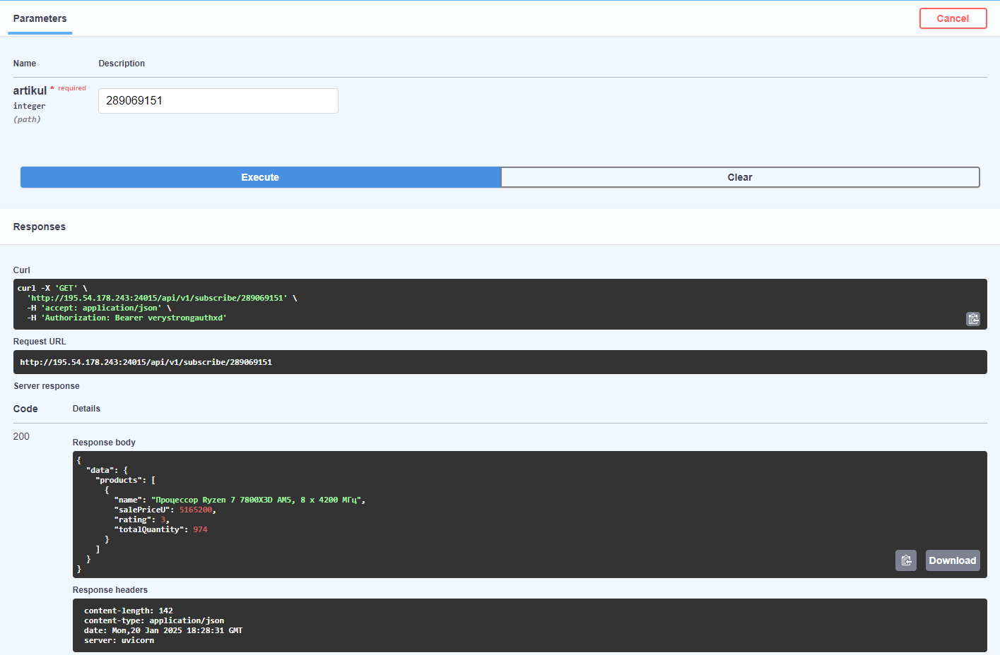

# WB Service


Описание:<br>
Серверная часть:<br>
RESTful API на Python с использованием фреймворка fastapi.

Эндпоинты:<br>
**POST** */api/v1/products*: при запросе на который по переданному артикулу товара с Wildberries (например: 211695539) начинается сбор данных в бд.<br>
Входные параметры: *артикул (articul)*.<br>
**GET** */api/v1/subscribe/{artikul}*: такой же сбор данных, но включается schedule на сбор данных каждые 30 минут.<br>

Аутентификация:<br>
**HTTP Bearer** ключ - *verystrongauthxd*

Описание бота:<br>
В боте реализована кнопка «Получить данные по товару», при нажатии на которую он запрашивает артикул, после чего присылает сообщение с самыми свежими данными из бд по этому артикулу

## Список примененных технологий:
- pydantic
- docker
- fastapi
- postgresql
- aiogram

Требования
<br>
Для запуска проекта вам понадобятся:
<br>
Docker (версия 20.10+)
<br>
Docker Compose (версия 1.29+)


## 🛠️ Для установки и запуска сервиса локально, нужно выполнить следующие действия:

- Клонирование репозитория
Клонируйте репозиторий проекта на свой локальный компьютер:
```cmd
git clone https://github.com/someqst/wb_service.git
cd wb_service/
```

- Настройка переменных окружения
Переименуйте файл .env.example в .env, вставьте свой токен бота

- Сборка и запуск контейнеров
Соберите и запустите проект с помощью Docker Compose:
```cmd
docker-compose up --build
```
После запуска проект будет доступен по адресу: http://127.0.0.1:8000

- Документация API
Документация автоматически генерируется FastAPI и доступна по адресу:

Swagger UI: http://127.0.0.1:8000/docs


## 🛠️ Для установки и запуска сервиса на сервере, нужно выполнить следующие действия:

- Приобрести VPS или VDS сервер

- Клонирование репозитория на сервер
Клонируйте репозиторий проекта на свой локальный компьютер:
```cmd
git clone https://github.com/someqst/wb_service.git
cd wb_service/
```

- Настройка переменных окружения
Переименуйте файл .env.example в .env, вставьте свой токен бота

- Сборка и запуск контейнеров
Соберите и запустите проект с помощью Docker Compose:
```cmd
docker-compose up --build
```
После запуска проект будет доступен по адресу:<br>
http://{внешний_адрес_вашего_сервера}:8000<br>
Чтобы сервер был доступен извне, стоит открыть порты на сервере, например, с помощью ufw:<br>
```cmd
sudo ufw allow 8000/tcp

sudo ufw reload

sudo ufw status
```

- Документация API
Документация автоматически генерируется FastAPI и доступна по адресу:

Swagger UI: http://127.0.0.1:8000/docs

# Примеры обращений к API через swagger
<picture>
  <source media="(prefers-color-scheme: dark)" srcset="./pictures/first.png">
  
</picture>
<picture>
  <source media="(prefers-color-scheme: dark)" srcset="./pictures/second.png">
  
</picture>